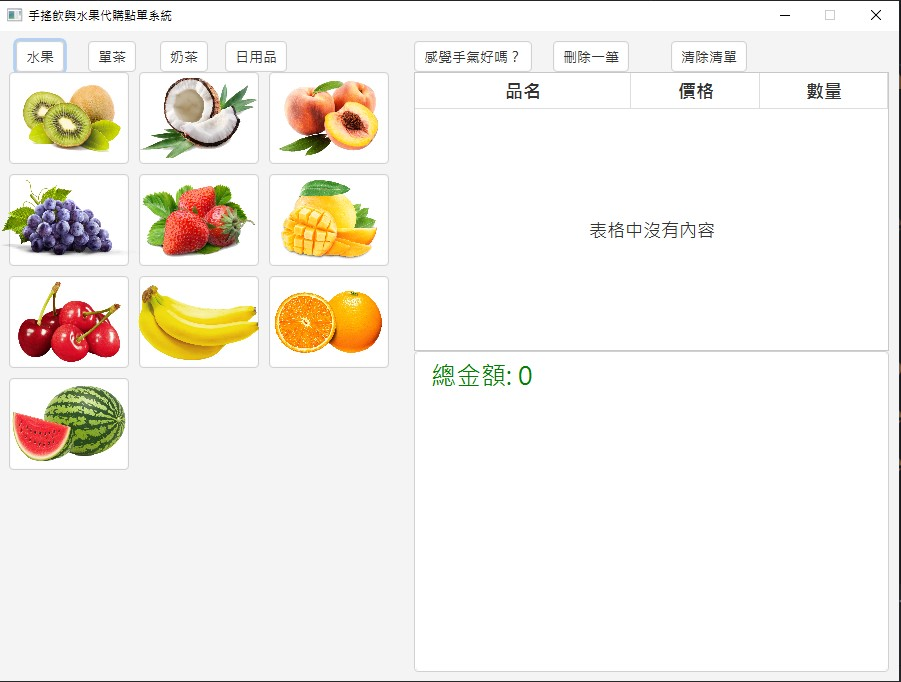
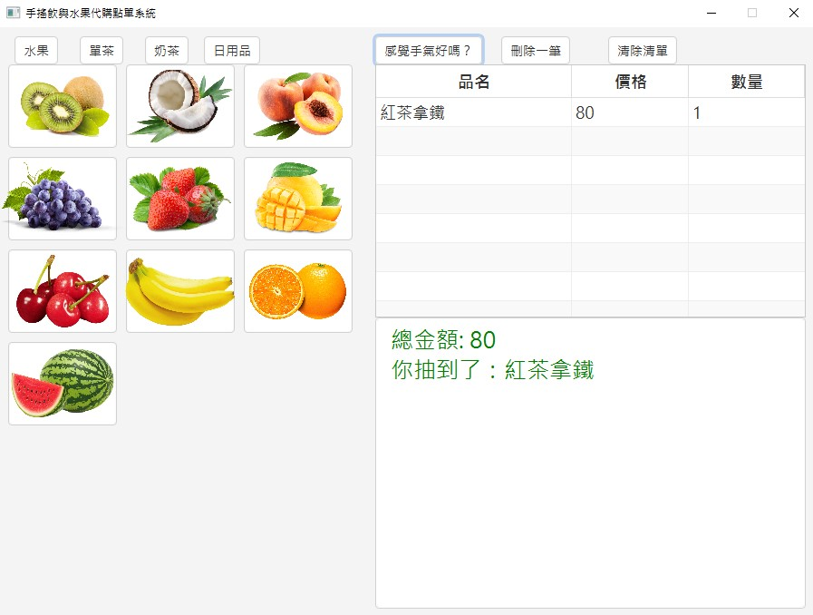
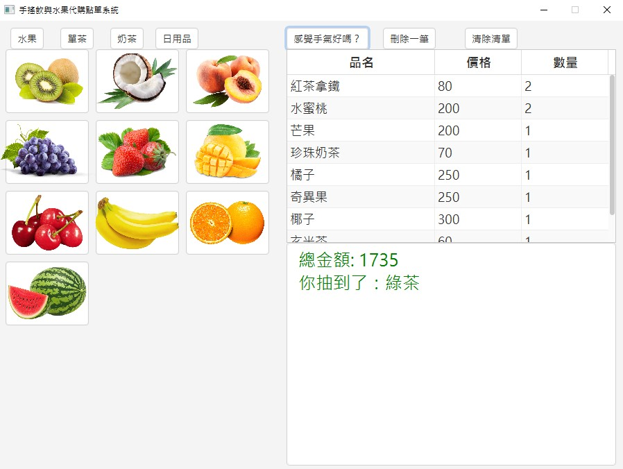
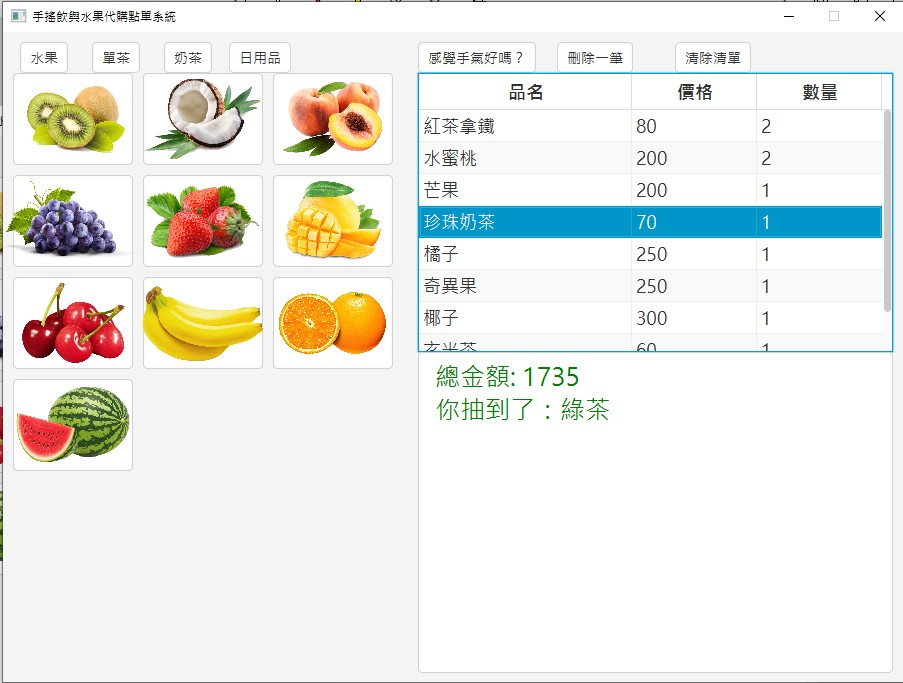
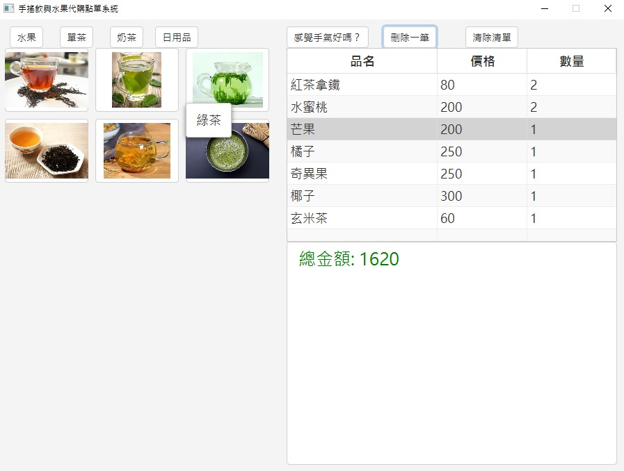
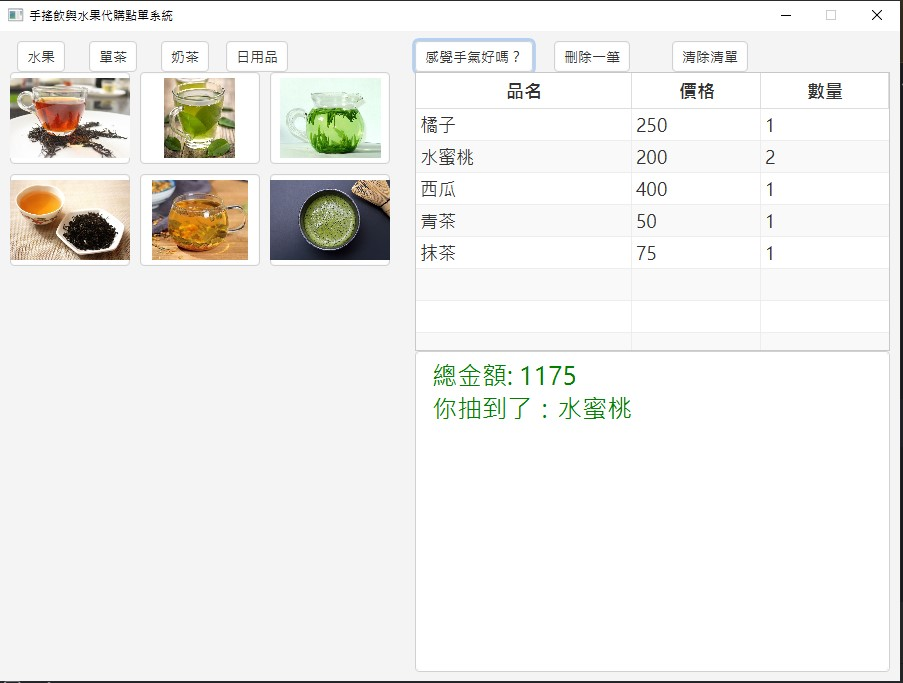
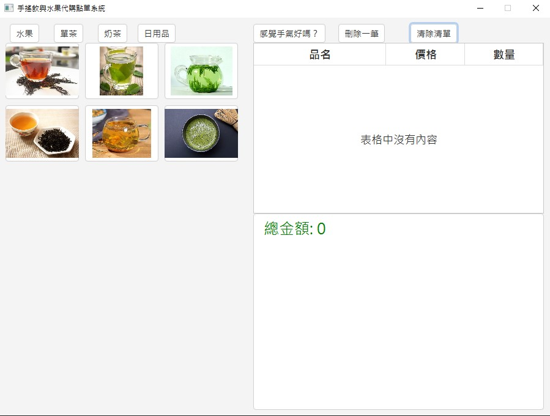

# JavaFxPos手搖飲及代購服務系統
主要是代購水果與一些日用品，例如：黏塵滾筒、洗衣精與水果等。而在現場也提供購買手搖飲的服務。主要賣項為茶類與奶茶為主的服務。
# JavaFx的截圖

## 感覺手氣好嗎？
靈感於google的「好手氣」功能，只能從水果、單茶與奶茶中亂數抽取，
不適用於日用品

## 刪除一筆
如果選取，就刪除選取項目，不選取就從第一個刪除

以上是選取後刪除

以上是不選取刪除
## 清除清單
直接將現有項目全部刪除。

## 修正了些小錯誤與增加小功能與樣式，包含：
+ 當「刪除一筆」沒有東西時，再點按會報IndexOutOfRange錯誤。Code中使用，if(order_list.isempty()){return;} 解決。
+ TableView可以自由改變順序，將三個欄位的Reorderable()屬性接關掉
+ 為點餐按鈕增加Tooltips來顯示單位與產品名稱，在TableView上面可以顯示Tooltip提醒使用者，可以修改數量。
+ 修改字體大小
+ 增加總金額的字體大小與設定成綠色，以及關閉setDisable(True)所產生的透明度。
+ 改變排版的方式